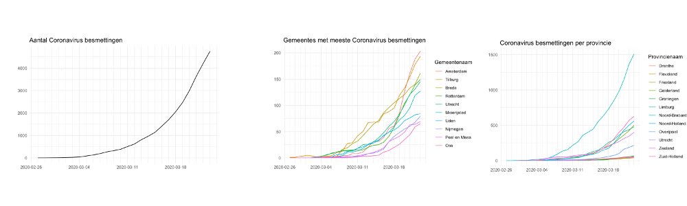
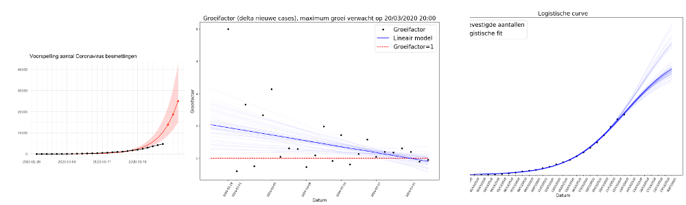
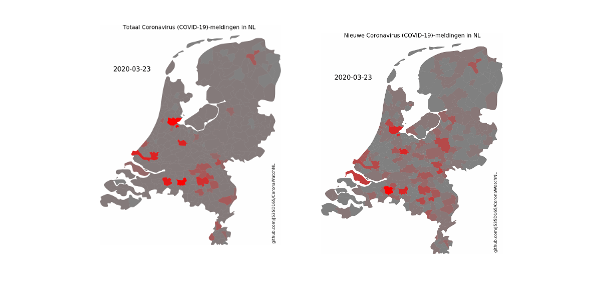

# CoronaWatchNL: COVID-19 case counts in The Netherlands

[**CoronaWatchNL**](https://github.com/J535D165/CoronaWatchNL) collects COVID-19 disease count cases in **The Netherlands**. Numbers are collected from the RIVM (National Institute for Public Health and the Environment) website on a daily basis. This project standardizes, and publishes data and makes it **Findable, Accessible, Interoperable, and Reusable (FAIR)**. We aim to collect a complete time series and prepare a dataset for reproducible analysis and academic use.

Dutch:
> CoronalWatchNL verzamelt ziektecijfers over COVID-19 in Nederland. Dagelijks worden de cijfers verzameld van de website van het RIVM. Dit project standaardiseert en publiceert de gegevens en maakt ze vindbaar, toegankelijk, interoperabel en herbruikbaar (FAIR). We streven ernaar om een dataset beschikbaar te stellen voor reproduceerbare analyses en wetenschappelijk gebruik.


# CoronaWatchNL_Models

**CoronaWatchNL_Models** is a collection of all charts, maps, and forecasts based on the datasets collected by [**CoronaWatchNL**](https://github.com/J535D165/CoronaWatchNL).

## Content

### Descriptive-charts
[](descriptive-charts) 

### Forecast-charts
[](forecast-charts) 

### Maps
[](maps) 

## Sources

The used datasets are obtained from the following sources.

| Source | Institute |Collected variables |
|---|---| --- |
| https://www.rivm.nl/nieuws/actuele-informatie-over-coronavirus | RIVM | Positively tested patients, Fatalities (total), Hospitalized (total) |
| https://www.rivm.nl/coronavirus-kaart-van-nederland-per-gemeente | RIVM | Positive tests per municipality |
| https://www.rivm.nl/nieuws/actuele-informatie-over-coronavirus/data | RIVM | Epidemiological reports |
| https://www.stichting-nice.nl/ | Stichting NICE | Postively tested patients admitted to IC, Number of ICUs with positively tested patient(s), Number of fatal IC cases, Number of survived IC cases  |


## Remarks

Since 3 March 2020, RIVM reports the number of diagnoses with the coronavirus and their municipality of residence on a daily base. The data contains the total number of positively tested patients. It is not a dataset with the current number of sick people in the Netherlands. The RIVM does not currently provide data on people who have been cured.


## License and academic use

The graphs and data are licensed [CC0](https://creativecommons.org/share-your-work/public-domain/cc0/). The original data is copyright RIVM.

For academic use, use presistent data from [](https://doi.org/10.5281/zenodo.3711575). This is a persistent copy of the data. Version number refer to the date. Please cite:

```De Bruin, J. (2020). Number of diagnoses with coronavirus disease (COVID-19) in The Netherlands (Version v2020.3.15) [Data set]. Zenodo. http://doi.org/10.5281/zenodo.3711575```

Image from [iXimus](https://pixabay.com/nl/users/iXimus-2352783/?utm_source=link-attribution&amp;utm_medium=referral&amp;utm_campaign=image&amp;utm_content=4901881) via [Pixabay](https://pixabay.com/nl/?utm_source=link-attribution&amp;utm_medium=referral&amp;utm_campaign=image&amp;utm_content=4901881)

## About CoronaWatchNL

**CoronaWatchNL** is collective of researchers and volunteers in The Netherlands. We aim to make the reported number on COVID-19 disease in The Netherlands FAIR. The project is initiated and maintained by [Utrecht University Research Data Management Support](https://www.uu.nl/en/research/research-data-management) and receives support from [Utrecht University Applied Data Science](https://www.uu.nl/en/research/applied-data-science). 

Help on this project is appreciated. We are looking for new graphs, forecasts, and maps. Please report issues in the Issue Tracker. Want to contribute? Please check out the `help wanted` tag in the [Issue Tracker](https://github.com/J535D165/CoronaWatchNL/issues). Do you wish to share an application based on these [datasets](/data)? Have a look at the [applications folder](https://github.com/J535D165/CoronaWatchNL/tree/master/applications).

Please send an email to jonathandebruinos@gmail.com and/or r.voorvaart@uu.nl
